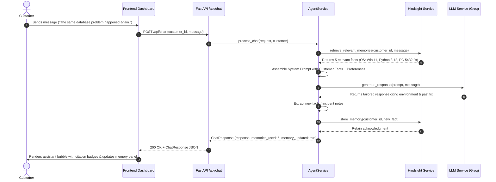

# 🏛️ MemoryDesk AI — Architecture & Technical Specification

## Overview

MemoryDesk AI is an enterprise-grade AI customer support application designed for **HackwithHyderabad 3.0**. The system demonstrates autonomous memory acquisition, multi-strategy memory recall, and contextual prompt synthesis using **Hindsight**, an open-source biomimetic agent memory engine by Vectorize.io.

---

## 1. High-Level Component Diagram

```
+-------------------------------------------------------------------------+
|                              FRONTEND LAYER                             |
|  - Vanilla HTML5 / CSS3 / ES6 (No heavy frameworks, fast load times)    |
|  - 3-Panel SaaS Workspace: Customer Switcher, Live Chat, Memory Panel   |
|  - Real-Time Indicators: Memory Citations, Learning Timeline, Toasts    |
+------------------------------------+------------------------------------+
                                     |
                         HTTP / REST | (JSON)
                                     v
+------------------------------------+------------------------------------+
|                               BACKEND API                               |
|  - FastAPI (Python 3.11 - 3.13)                                         |
|  - Pydantic v2 Models: Schema Validation, Type Safety, OpenAPI Specs    |
|  - Routes: /api/chat, /api/customers, /api/memory, /api/health          |
+------------------------------------+------------------------------------+
                                     |
                                     v
+------------------------------------+------------------------------------+
|                         AGENT ORCHESTRATOR                              |
|  - AgentService: Manages the complete cognitive memory loop             |
|  - Extracts entities (OS, Python version, error messages, preferences)  |
|  - Formats system prompts with verified persistent memory facts         |
+-------------------+--------------------------------+--------------------+
                    |                                |
        Recall /    |                    LLM Context |
        Retain SDK  |                    Completion  |
                    v                                v
+-------------------+-----------------+  +-----------+--------------------+
|         HINDSIGHT MEMORY SERVICE    |  |          LLM SERVICE           |
| - Official SDK: hindsight-client    |  | - Provider: Groq API           |
| - Multi-strategy recall (BM25,      |  | - Model: Llama 3.3 70B         |
|   semantic similarity, temporal)    |  | - Fail-Safe Contextual Engine  |
| - Isolated customer memory banks    |  | - Strict memory grounding      |
| - Biomimetic fact storage           |  +--------------------------------+
+-------------------------------------+
```

---

## 2. Hindsight Memory Subsystem

### 2.1 Bank Isolation
Every customer is assigned an isolated memory bank:
$$\text{Bank ID} = \text{customer\_id} \quad (\text{e.g., } \texttt{cust\_rahul}, \texttt{cust\_priya})$$
This guarantees that memories from one customer never pollute another customer's context.

### 2.2 Core Operations
1. **`retain(bank_id, content, metadata, tags)`**
   - Ingests incoming text units.
   - Extracts facts and entities.
   - Assigns categorization tags (`environment`, `preference`, `issue`, `identity`).
2. **`recall(bank_id, query, max_tokens, budget)`**
   - Retrieves the most relevant memories for the incoming query using 4 parallel strategies:
     - **Semantic vector similarity**
     - **Lexical keyword scoring (BM25)**
     - **Graph-based relationship traversal**
     - **Temporal decay & recency filtering**
   - Surfaces top results and formats them into a clean prompt context string via `to_prompt_string()`.
3. **`list_memories(bank_id)`**
   - Surfaces all memory units for a bank to populate the real-time UI inspector and learning timeline.

### 2.3 Resilient Persistence Architecture
- **Primary:** Communicates directly with the official Hindsight server via `HINDSIGHT_URL` (`http://localhost:8888` or Hindsight Cloud) using `hindsight_client.Hindsight`.
- **Local Persistence Bank:** MemoryDesk maintains a synchronized local persistent bank on disk (`data/local_memory_banks/{bank_id}.json`). If the external Hindsight container is stopped or offline, the application seamlessly uses the local persistence engine without crashing or dropping customer data.

---

## 3. Cognitive Agent Loop

When a user sends a message (`POST /api/chat`):



---

## 4. API Specification

| Endpoint | Method | Description |
| :--- | :--- | :--- |
| `/api/health` | `GET` | Health status, Hindsight connection diagnostics, active customers count |
| `/api/customers` | `GET` | List all synthetic demo customers with profiles |
| `/api/customers` | `POST` | Register a new customer & initialize their Hindsight bank |
| `/api/customers/{id}` | `GET` | Retrieve single customer metadata |
| `/api/customers/{id}/conversations` | `GET` | Retrieve conversation turn history |
| `/api/customers/{id}/memory` | `GET` | Retrieve customer's structured profile, timeline, & all memory units |
| `/api/memory/search` | `POST` | Execute semantic query across customer memory bank |
| `/api/chat` | `POST` | Execute the cognitive memory loop and generate support response |

---

## 5. Security & Reliability Considerations

1. **Zero Secret Leakage:** No API keys are embedded in frontend scripts or committed to Git. All keys are loaded from `.env` on startup.
2. **Graceful Degradation:** If `GROQ_API_KEY` is not provided, the contextual fallback engine uses the retrieved Hindsight memories to generate accurate responses, ensuring hackathon demonstrations succeed under any network condition.
3. **Pydantic Validation:** All incoming and outgoing payloads are strictly validated using Pydantic v2 schemas.
