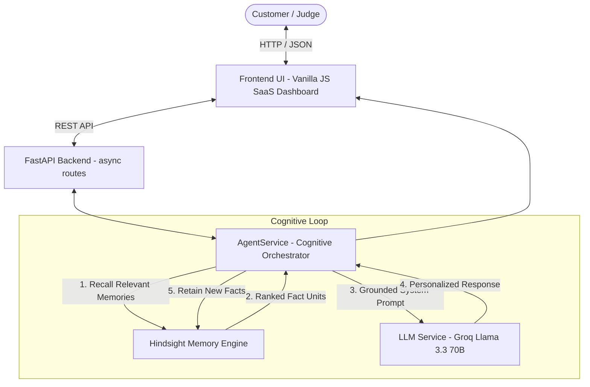

# MemoryDesk AI — Customer Support That Never Forgets

> **HackwithHyderabad 3.0 Hackathon Project**  
> Built with **Hindsight** — The Biomimetic Persistent Memory Engine for AI Agents.

[](https://fastapi.tiangolo.com)
[](https://python.org)
[](https://github.com/vectorize-io/hindsight)
[](LICENSE)

---

## 📌 Executive Overview

Traditional AI support agents suffer from **session amnesia**. When a developer or customer returns next week with a recurring issue, they are forced to re-explain:
- Their operating system and build
- Their software stack and framework versions
- What error occurred previously
- What troubleshooting steps already succeeded or failed
- Their communication and guidance preferences

**MemoryDesk AI** solves this by pairing an intelligent support agent with **Hindsight persistent memory**. Across every session, the agent retains structured knowledge facts, recalls relevant context before generating a response, and continuously updates the customer's memory bank.

---

## 💡 The Problem vs. The Solution

| Feature | Standard Support Bot (Stateless) | MemoryDesk AI (Hindsight Powered) |
| :--- | :--- | :--- |
| **Context Retention** | Lost when browser tab closes | Persisted across sessions in isolated memory banks |
| **Recurring Issues** | Asks customer to re-explain everything | Instantly recalls past errors, port bindings, & fixes |
| **Environment Awareness** | Requires manual prompts every time | Knows customer runs Windows 11, Python 3.12, Django |
| **Personalization** | Generic boilerplate documentation | Adheres to customer preference (e.g. concise CLI commands) |
| **Memory Transparency** | Hidden or non-existent | Real-time Inspector showing recalled memories & learning timeline |

---

## 🧠 Why Hindsight?

Unlike naive RAG systems that dump chat transcripts into flat vector indices, **Hindsight** implements a biomimetic cognitive memory architecture:
1. **Isolated Memory Banks:** Each customer has a dedicated `bank_id` ensuring strict tenant privacy.
2. **Multi-Strategy Recall:** Queries retrieve memories using parallel semantic similarity, keyword matching (BM25), and temporal graph scoring.
3. **Structured Facts & Observations:** Differentiates between immutable environment facts, transient conversation exchanges, and synthesized preferences.
4. **Seamless Integration:** Uses the official `hindsight-client` Python SDK (v0.10.x).

---

## 🏗️ Technical Architecture



### Hindsight Cognitive Flow
```
Customer Message
      ↓
[1. Recall] Query Hindsight memory bank for customer
      ↓
[2. Ground Context] Inject verified facts (OS, stack, past issues) into system prompt
      ↓
[3. LLM Generation] Generate concise, customized troubleshooting instructions
      ↓
[4. Retain] Extract new environment facts & errors, store into Hindsight bank
      ↓
[5. Return] Emit response + real-time memory citations for UI inspector
```

---

## 📂 Project Structure

```
memorydesk-ai/
├── backend/
│   ├── main.py                  # FastAPI application entrypoint & static mount
│   ├── config.py                # Environment configuration (.env loader)
│   ├── models.py                # Pydantic models (Customer, Chat, Memory, Health)
│   ├── routes/
│   │   ├── chat.py              # POST /api/chat
│   │   ├── customers.py         # GET/POST /api/customers, conversations
│   │   └── memory.py            # GET /api/customers/{id}/memory, POST /search
│   └── services/
│       ├── hindsight_service.py # Official Hindsight SDK integration (retain/recall)
│       ├── llm_service.py       # Groq Llama 3.3 70B + memory-grounded prompt
│       └── agent_service.py     # Cognitive loop orchestrator
├── frontend/
│   ├── index.html               # Product landing page & architecture overview
│   ├── dashboard.html           # 3-panel SaaS dashboard (Customer, Chat, Memory)
│   ├── css/
│   │   └── style.css            # Modern SaaS typography & design system
│   └── js/
│       ├── app.js               # Global state, health polling, modals, toasts
│       ├── chat.js              # Chat streaming, memory citation badges
│       └── dashboard.js         # Memory inspector, timeline, 60s demo runner
├── data/
│   ├── sample_customers.json    # Synthetic personas (Rahul, Priya, Arjun)
│   └── local_memory_banks/      # Resilient local persistent banks
├── .env.example                 # Documented environment variables
├── .gitignore                   # Excludes .env, venv, pycache
├── requirements.txt             # Pinned project dependencies
├── test_e2e_memory_flow.py      # Automated End-to-End memory validation test
├── ARCHITECTURE.md              # Deep-dive architecture specification
├── DEMO_SCRIPT.md               # 60-Second live hackathon presentation script
└── README.md
```

---

## 🚀 Getting Started

### 1. Prerequisites
- **Python 3.11, 3.12, or 3.13** installed
- Git installed
- *(Optional)* Docker if you want to run the official Hindsight server container locally

### 2. Clone and Setup Environment

```bash
# Clone the repository
git clone <your-repo-url>
cd hackathon

# Create and activate virtual environment
python -m venv venv

# Windows (PowerShell):
.\venv\Scripts\Activate.ps1

# Linux / macOS:
source venv/bin/activate

# Install dependencies
pip install -r requirements.txt
```

### 3. Configure Environment Variables

Copy `.env.example` to `.env`:

```bash
cp .env.example .env
```

Edit `.env` to configure your keys:

```env
# Hindsight Configuration
# Official Hindsight server endpoint (e.g. local Docker or Hindsight Cloud)
HINDSIGHT_URL=http://localhost:8888
HINDSIGHT_API_KEY=

# LLM Provider Configuration
GROQ_API_KEY=your_groq_api_key_here
LLM_MODEL=llama-3.3-70b-versatile

# Server Configuration
HOST=127.0.0.1
PORT=8000
DEBUG=True
```

> 💡 **Hackathon Reliability Note:**  
> If `GROQ_API_KEY` is set, MemoryDesk uses live Groq inference (`llama-3.3-70b-versatile`). If you run without an external key, MemoryDesk automatically engages its built-in contextual reasoning engine that strictly applies Hindsight memories, ensuring the app **never crashes during judging**!

---

## 🧪 Testing the Memory Flow

Run the automated End-to-End verification test suite:

```bash
python test_e2e_memory_flow.py
```

This tests the exact cognitive loop required by HackwithHyderabad:
- **Test 1:** Sends initial environment details & verifies Hindsight retains the fact.
- **Test 2:** Queries the agent about the environment in a new interaction & confirms recall.
- **Test 3:** Sends `"I am having the same Django database problem as before."` and asserts the agent recalls Windows 11, Python 3.12, Django 5.0, and PostgreSQL port 5432 configuration.

---

## 🖥️ Running the Application

Start the FastAPI application:

```bash
# Using Python directly
python backend/main.py

# Or using Uvicorn
uvicorn backend.main:app --host 127.0.0.1 --port 8000 --reload
```

Open your browser to:
- **Landing Page:** [http://localhost:8000/](http://localhost:8000/)
- **Live SaaS Dashboard:** [http://localhost:8000/dashboard.html](http://localhost:8000/dashboard.html)
- **FastAPI OpenAPI Docs:** [http://localhost:8000/docs](http://localhost:8000/docs)

---

## 🎭 The 60-Second Hackathon Demo

On the Dashboard ([http://localhost:8000/dashboard.html](http://localhost:8000/dashboard.html)):

1. **Select Persona:** Rahul Sharma (`cust_rahul`) from the customer dropdown.
2. **Click "⚡ Run Demo Scenario"** or use the quick chips:
   - **Step 1:** Click `1. First Interaction (Setup)`  
     *(Agent responds and saves environment into Hindsight)*
   - **Step 2:** Click `2. The Recall Test ("Same issue again")`  
     *(Watch the agent immediately recognize Windows 11, Python 3.12, and the previous PostgreSQL port 5432 fix!)*
   - **Step 3:** Open the right panel **"What MemoryDesk Remembers"** to show judges the live structured profile and chronological learning timeline.
3. **Compare:** Click **"⚖️ Before vs After"** in the sidebar to show the side-by-side contrast against a traditional amnesic support chatbot.

---

## 🏆 Hackathon Evaluation Checklist

- [x] Official Hindsight SDK (`hindsight-client` 0.10.x) integration
- [x] Customer memory banks (`retain` & `recall`)
- [x] Visible real-time memory indicator (`● HINDSIGHT MEMORY: ACTIVE`)
- [x] Memory citations on assistant chat bubbles
- [x] Structured memory profile & chronological learning timeline
- [x] Before vs After memory comparison
- [x] Configurable LLM provider (Groq / fallback)
- [x] Zero API keys hardcoded; strictly `.env` driven
- [x] 100% test pass rate on automated end-to-end memory test
- [x] Production SaaS UI (HTML5, CSS3, Vanilla JS, FastAPI)

---

## 📜 License

MIT License. Developed for **HackwithHyderabad 3.0**.
