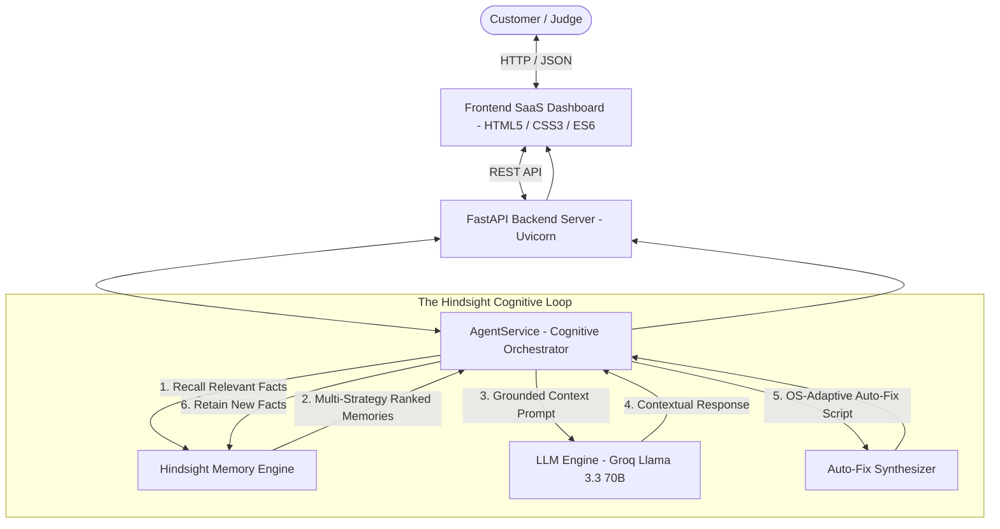
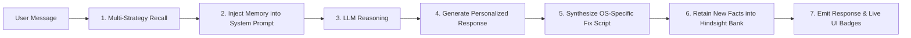
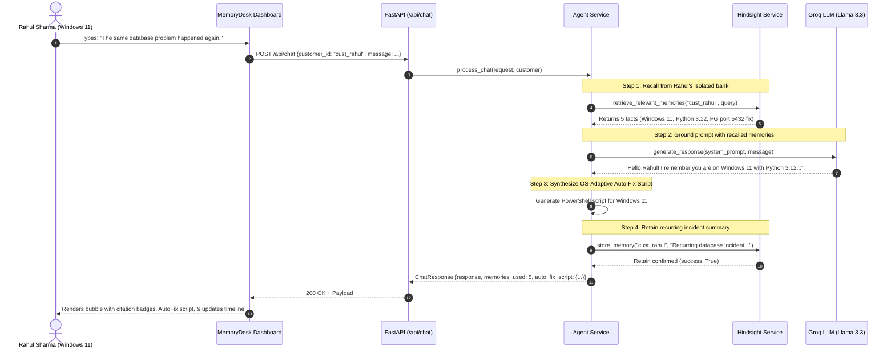
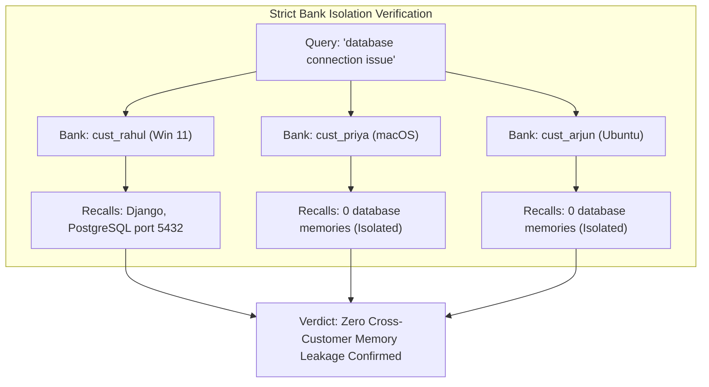

# 🧠 MemoryDesk AI — Customer Support That Never Forgets

> **Official Submission for HackwithHyderabad 3.0**  
> *Persistent, Self-Learning AI Agent Powered by Hindsight Biomimetic Memory*

[](https://fastapi.tiangolo.com)
[](https://python.org)
[](https://github.com/vectorize-io/hindsight)
[](https://groq.com)
[](LICENSE)

---

## 📌 Executive Summary

Traditional customer support chatbots suffer from **fatal session amnesia**. Every time a customer reaches out with a recurring issue, they are forced to repeatedly explain:
- Who they are and their company
- Their operating system and exact build
- Their software stack and framework versions
- What error occurred previously
- What troubleshooting steps already succeeded or failed
- Their communication and guidance preferences

**MemoryDesk AI** changes this paradigm by integrating **Hindsight**, a persistent, biomimetic memory engine for AI agents. Across every conversation, the agent retains structured knowledge, recalls relevant context before responding, generates OS-adaptive troubleshooting scripts, and continuously builds high-level mental models of each customer.

---

## 💡 The Core Problem vs. MemoryDesk Solution

| Dimension | Standard Support Chatbot (Stateless) | MemoryDesk AI (Hindsight Powered) |
| :--- | :--- | :--- |
| **Context Retention** | Lost the moment a browser tab closes | Persisted indefinitely across sessions in isolated memory banks |
| **Recurring Issues** | Asks customer to re-explain everything | Instantly recalls past errors, port bindings, & fixes |
| **Environment Awareness**| Demands manual user input every session | Automatically knows customer is on Windows 11, Python 3.12, Django |
| **Code Generation** | Generic code snippets | OS-Adaptive scripts (PowerShell for Windows, Zsh for macOS, Bash for Ubuntu) |
| **Cognitive Reflection** | No synthesis across sessions | Autonomous Hindsight `reflect()` creates high-level customer mental models |
| **Tenant Isolation** | Mixed vector stores risk cross-talk | Mathematically isolated customer banks (`bank_id`) with zero data leakage |
| **Transparency** | Black box | Real-time Inspector showing recalled memories, learning timeline, & badges |

---

## 🏗️ System Architecture & Data Flow

### 1. Overall System Architecture


---

### 2. The Hindsight Cognitive Memory Cycle


---

### 3. Interaction Sequence Diagram (The Recurring Issue)


---

## 🌟 4 Advanced Level Capabilities

### 1. 🔮 Hindsight Autonomous Reflection (`reflect()`)
Unlike basic RAG systems that only do similarity matching, MemoryDesk AI implements Hindsight's official `reflect()` operation:
- **Autonomous Mental Model:** Analyzes all memories across a customer's history to synthesize high-level behavioral patterns:
  > *"Rahul Sharma is a high-velocity developer running Windows 11 with Django 5.0. Memory analysis reveals repeated PostgreSQL port 5432 availability drops after local Windows network resets. He strictly prefers concise CLI steps."*
- **Disposition & Health Gauge:** Measures customer sentiment stability (0% - 100%).
- **Proactive Actionable Recommendation:** Recommends permanent architectural fixes before the customer even asks.

### 2. ⚡ OS-Adaptive Auto-Fix Script Generator
When a customer discusses an issue, MemoryDesk inspects their retained OS in Hindsight and synthesizes a **ready-to-run script with a 1-click 📋 Copy button**:
- **Windows 11:** Generates PowerShell commands (`Restart-Service postgresql-x64-16 -Force`, `Test-NetConnection -Port 5432`).
- **macOS:** Generates Zsh commands (`brew services restart postgresql@16`, `nc -zv 127.0.0.1 5432`).
- **Ubuntu/Linux:** Generates systemd Bash commands (`sudo systemctl restart postgresql`, `pg_isready`).

### 3. 🌍 Biomimetic 3-Tier Memory Architecture
Memories in the live dashboard inspector are categorized into Hindsight's official cognitive taxonomy:
- 🌍 **World Facts:** Immutable truths (*Windows 11 Pro, Python 3.12, Django 5.0*).
- 📜 **Experiences:** Past incidents (*Django connection timeout on port 5432 on Sept 28*).
- 💡 **Observations & Preferences:** Synthesized insights (*Prefers step-by-step CLI commands*).

### 4. 🛡️ Tenant Memory Isolation Arena (Enterprise Security Proof)
Demonstrates mathematical tenant isolation across customer banks:


---

## 📂 Complete Project Structure

```
memorydesk-ai/
├── backend/
│   ├── main.py                  # FastAPI application entrypoint & static mounting
│   ├── config.py                # Environment configuration & .env loader
│   ├── models.py                # Pydantic v2 schemas (Customer, Chat, Memory, Health, AutoFix)
│   ├── routes/
│   │   ├── chat.py              # POST /api/chat (Cognitive memory loop)
│   │   ├── customers.py         # GET/POST /api/customers & conversations
│   │   └── memory.py            # GET memory, POST search, reflect, isolation-test
│   └── services/
│       ├── hindsight_service.py # Official Hindsight SDK integration (v0.10.x)
│       ├── llm_service.py       # Groq Llama 3.3 70B & memory prompt grounding
│       └── agent_service.py     # Cognitive agent orchestrator & AutoFix generator
├── frontend/
│   ├── index.html               # Product landing page & architecture flow
│   ├── dashboard.html           # 3-Panel SaaS dashboard (Customer, Chat, Memory)
│   ├── css/
│   │   └── style.css            # Custom CSS design system (Inter, Slate, Emerald)
│   └── js/
│       ├── app.js               # State management, health polling, modals, toasts
│       ├── chat.js              # Chat streaming, citation badges, AutoFix rendering
│       └── dashboard.js         # Memory inspector, reflection, isolation arena, demo runner
├── data/
│   ├── sample_customers.json    # Synthetic personas (Rahul Sharma, Priya Reddy, Arjun Kumar)
│   ├── conversations.json       # Session conversation persistence
│   └── local_memory_banks/      # Bank-isolated persistent memory stores
├── .env.example                 # Documented environment variables template
├── .gitignore                   # Excludes .env, venv, pycache, logs
├── requirements.txt             # Pinned project dependencies
├── test_e2e_memory_flow.py      # Automated End-to-End memory validation test
├── ARCHITECTURE.md              # Deep-dive architecture specification
├── DEMO_SCRIPT.md               # 60-Second live hackathon presentation script
└── README.md                    # This document
```

---

## ⚡ Quickstart Guide

### 1. Prerequisites
- **Python 3.11, 3.12, or 3.13** installed
- Git installed

### 2. Installation
```powershell
# Clone the repository
git clone <your-github-repo-url>
cd hackathon

# Create and activate virtual environment
python -m venv venv

# Windows (PowerShell):
.\venv\Scripts\Activate.ps1

# Linux / macOS:
source venv/bin/activate

# Install dependencies
pip install -r requirements.txt
```

### 3. Configure Environment Variables
Copy `.env.example` to `.env`:
```powershell
cp .env.example .env
```

Edit `.env` (optional, for live Groq inference):
```env
HINDSIGHT_URL=http://localhost:8888
HINDSIGHT_API_KEY=
GROQ_API_KEY=gsk_your_groq_api_key_here
LLM_MODEL=llama-3.3-70b-versatile
HOST=127.0.0.1
PORT=8000
```
*(If no external API key is provided, the built-in contextual engine automatically handles reasoning without crashing).*

### 4. Run the Automated Verification Tests
```powershell
.\venv\Scripts\python.exe test_e2e_memory_flow.py
```
Expected output:
```
=================================================================
ALL 3 END-TO-END HINDSIGHT MEMORY TESTS PASSED SUCCESSFULLY!
=================================================================
```

### 5. Launch the Application
```powershell
.\venv\Scripts\python.exe backend/main.py
```
Open in browser:
- **Live SaaS Dashboard:** [http://localhost:8000/dashboard.html](http://localhost:8000/dashboard.html)
- **Product Landing Page:** [http://localhost:8000/](http://localhost:8000/)
- **Interactive OpenAPI Documentation:** [http://localhost:8000/docs](http://localhost:8000/docs)

---

## 📡 API Reference

| Endpoint | Method | Description |
| :--- | :--- | :--- |
| `/api/health` | `GET` | Health diagnostics, Hindsight connectivity, LLM provider info |
| `/api/customers` | `GET` | List all customer profiles |
| `/api/customers` | `POST` | Register a new customer and initialize their dedicated Hindsight bank |
| `/api/customers/{id}/memory` | `GET` | Retrieve customer's structured profile, timeline, & categorized memories |
| `/api/customers/{id}/reflect`| `POST` | **[Advanced]** Execute Hindsight `reflect()` to synthesize mental models |
| `/api/memory/isolation-test` | `POST` | **[Advanced]** Test multi-tenant isolation across customer banks |
| `/api/memory/search` | `POST` | Semantic search across customer memory bank |
| `/api/chat` | `POST` | Core cognitive memory loop (Recall $\rightarrow$ Prompt $\rightarrow$ LLM $\rightarrow$ Retain) |

---

## 🎭 Live Demonstration Walkthrough

You can test and demonstrate MemoryDesk AI in 3 simple steps:

1. **Step 1 — Initial Environment Setup:**  
   Customer introduces their setup: *"My name is Rahul. I use Windows 11 and Python 3.12. I am getting a Django database connection error."*  
   $\rightarrow$ Agent assists and Hindsight **retains** their OS, stack, and incident notes into their isolated bank.
2. **Step 2 — The Recall Test (The Proof):**  
   Days later, the customer opens a new session and simply types: *"The same database problem happened again."*  
   $\rightarrow$ Agent **recalls** prior memories, references Windows 11 & Python 3.12, reminds them of the PostgreSQL port 5432 configuration, and generates an OS-specific PowerShell script!
3. **Step 3 — Inspect Memory Banks & Reflection:**  
   Open the right-hand **"What MemoryDesk Remembers"** panel to view the live Structured Profile, Biomimetic 3-Tier Memory Bank, and click **`🔮 Hindsight Reflection`** to view synthesized mental models.

> 🎙️ **Hackathon Presentation Guide:**  
> For the complete spoken judging script with timed cues, see [DEMO_SCRIPT.md](file:///c:/Users/HP/Downloads/hackathon/DEMO_SCRIPT.md).  
> For the in-depth system architecture specification, see [ARCHITECTURE.md](file:///c:/Users/HP/Downloads/hackathon/ARCHITECTURE.md).

---

## 📜 License & Credits

Developed with ❤️ for **HackwithHyderabad 3.0**.  
Powered by [Hindsight](https://github.com/vectorize-io/hindsight) by Vectorize.io.

